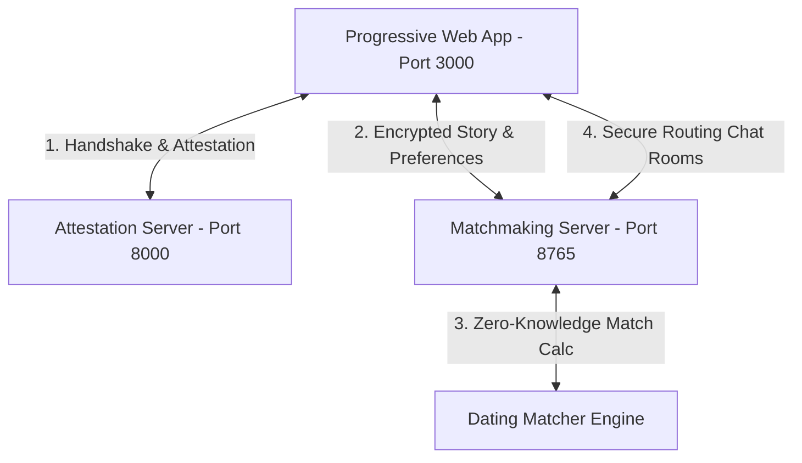

# DayTEE 🍵🔒

> **Confidential AI Matchmaking in Secure Hardware Enclaves**
> 
> *A project by Team **Kolosok** (TUM Science Hackathon 2026)*

---

## 💡 The Concept & Naming
**DayTEE** is a privacy-first matchmaking application built on secure enclaves. The name is a multi-layered pun:
1. **Dating / "Date-y" (`DayTEE`)**: Emphasizes our core goal—bringing people together for romantic connections and day dates.
2. **Tea Time (`Tea`)**: Represents cozy, casual first-date encounters over a cup of tea. It also references "spilling the tea" (sharing your life stories in complete confidence).
3. **Trusted Execution Environment (`TEE`)**: Emphasizes our core security architecture. Your profile data and life stories are never visible in plaintext on server hard disks; they are encrypted and processed inside secure CPU hardware enclaves (Intel TDX / AMD SEV).

---

## 🏗️ Architecture Overview

The system consists of three independent components:



### 1. Attestation Handshake Server (`main.py`)
Runs on the enclave system to bootstrap trust:
- Generates static asymmetric project keypairs (`private_key.pem`, `public_key.pem`).
- Exposes a `/handshake` endpoint providing the public key and a raw hardware **Remote Attestation Quote** (fetched from the local `tappd` dstack daemon inside the Intel TDX enclave).
- Allows clients to verify that the server is genuine hardware and running unmodified, open-source code before submitting data.

### 2. Matchmaking Backend Enclave (`server/app.py`)
An API server running inside the enclave managing matches and communication:
- Handles profile and preferences submissions.
- **Confidential AI Matcher (`server/dating_matching_ai.py`)**: Computes semantic compatibility scores between user stories using advanced NLP (Sentence-Transformers / lightweight fallback) without exposing raw details.
- **Anti-Phishing Shield**: Rate-limits requests and applies fuzzed score verification thresholds to prevent adversarial users from gaming the enclave to reconstruct other users' parameters.
- **Room Key Router**: Sets up secure chat rooms utilizing keys generated inside the enclave.

### 3. PWA Frontend (`client/`)
An installable client application:
- Includes a custom-built, responsive **Horizontal Age Selector Carousel** starting from 18, utilizing programmatic snapping.
- **Languages Custom Dialog**: Organized by linguistic family grouping to search and toggle preferences.
- **PWA Service Worker Caching (`sw.js`)**: Caches static assets for offline capability and fast load times.

---

## 🚀 Setup & Execution

### Prerequisites
- **Python 3.9+** (installed on local system)
- **Node.js & npm**

---

### Step 1: Start the Attestation Server
1. Navigate to the root directory.
2. Install cryptography requirements if missing:
   ```bash
   pip install cryptography requests fastapi uvicorn
   ```
3. Start the FastAPI app:
   ```bash
   python -m uvicorn main:app --port 8000
   ```
   *Note: If running outside a live TEE context, it will generate a simulated test quote.*

---

### Step 2: Start the Matchmaking Backend
1. Navigate to the `server/` directory:
   ```bash
   cd server
   ```
2. Install the python dependencies:
   ```bash
   pip install -r requirements.txt
   ```
3. Start the uvicorn API server on port `8765`:
   ```bash
   python -m uvicorn app:app --port 8765
   ```
   *The database is mocked in `server/db.json` and cleared automatically upon reset.*

---

### Step 3: Start the Client Web App
1. Navigate to the `client/` directory:
   ```bash
   cd ../client
   ```
2. Install standard Node server dependencies (if first time running):
   ```bash
   npm install
   ```
3. Run the static file dev server:
   ```bash
   node server.js
   ```
   *The app is served at [http://localhost:3000](http://localhost:3000).*

---

## 🔒 Security Principles
- **Zero public directory**: No directories, matching lists, or swipe lists exist. Users only discover each other when a highly compatible cryptographic matching channel is generated inside the enclave.
- **Ephemeral Storage**: Server data is stored inside local RAM enclaves. Admin triggers or server power cycles wipe all memory logs automatically.
- **Git Safety**: Local databases (`db.json` files) are automatically ignored by `.gitignore` to prevent secret leaking.
